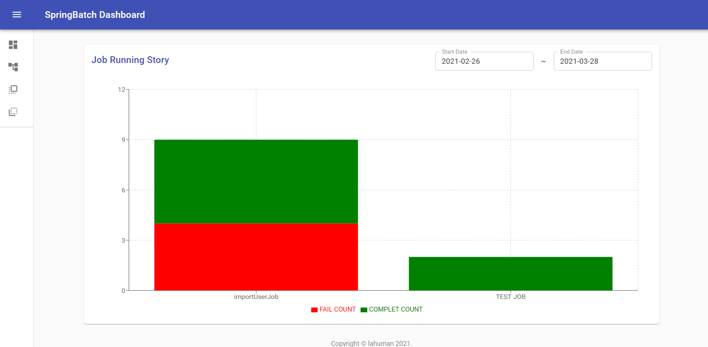
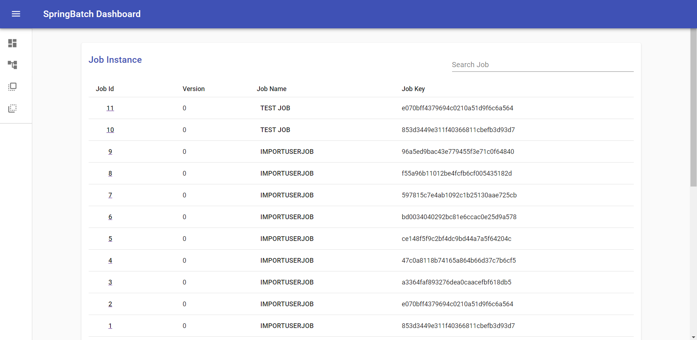
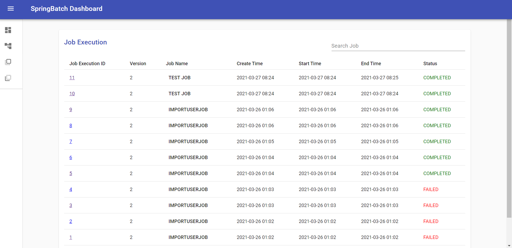
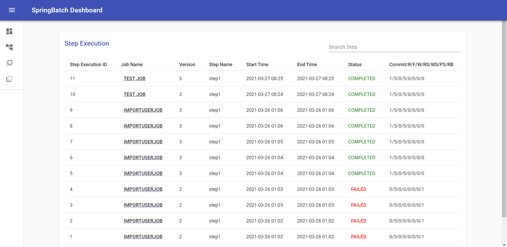
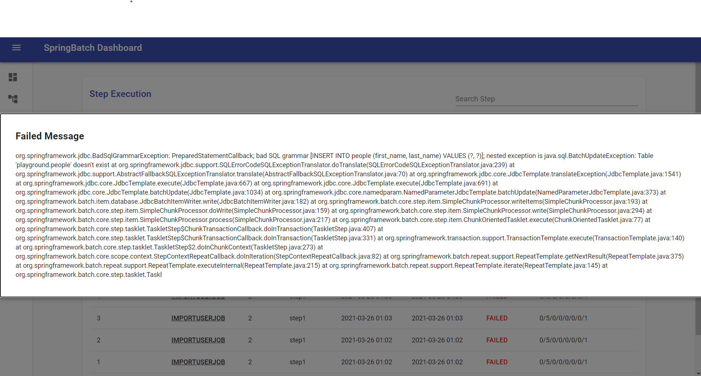

# Srping Batch DashBoard

We developed a search function for Meta information of Spring Batch.

The existing [Spring Batch Admin](https://docs.spring.io/spring-batch-admin/trunk/) was terminated, and [spring-cloud-dataflow] (https://spring.io/projects/ spring) -cloud-dataflow) is recommended.

Developed for simple BATCH execution MEAT information inquiry.

## Getting Started

These instructions will get you a copy of the project up and running on your local machine for development and testing purposes. See deployment for notes on how to deploy the project on a live system.


### Screenshot

#### Dashboard


#### Job Instance List


#### Job Execute List


#### Step Execute List




### Prerequisites

What things you need to install the software and how to install them

- Backend : [nestjs](https://nestjs.com/)
- Frontend : [reactjs](https://reactjs.org/)

#### backend

Change _env to .env and enter Spring Batch Meta DB information.

```
$ cd backend
$ mv _env .env
```

### frontend

Change _env to .env.

```
$ cd frontend
$ mv _env .env
```

### Installing

Install the node module in the backend / frontend.

```
$ cd backend / frontend
$ npm install
```

### Running 

In the case of operation, backend / frontend is used by building.

```
$ cd backend / frontend
$ npm run build

... Use backend/dist frontend/build.
```

Development case

```
$ cd backend / frontend
$ npm run start

... Enter http://localhost:8080 in the browser to use
```


## License

This project is licensed under the MIT License - see the [LICENSE](https://en.wikipedia.org/wiki/MIT_License) file for details
